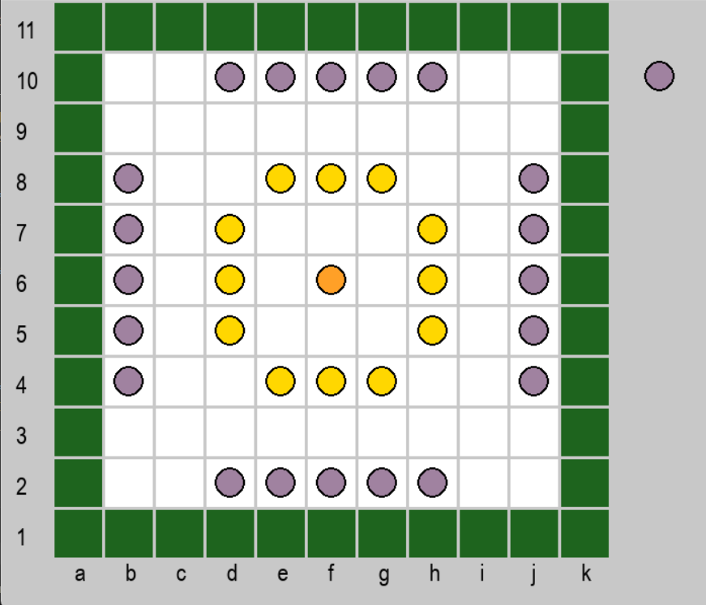

# Intro
This project is an implementation of a board game - [Breakthru](https://en.wikipedia.org/wiki/Breakthru_(board_game)). This was developed as part of `Intelligent Search & Games` course in my Master's program. The goal was to implement a game AI. 

Conceptually, it consists of two parts:
- the actual game — the board, the logic, the GUI that allows the game to be played by 2 human players.
- a game AI that simulates the adversary based on multiple game and decision theory strategies.

To initiate the AI player's turn you have to click the mouse button. I click to initiate each action, the current player's turn is displayed in the top left of the game screen. Mulitple types of AIs have been implemented, but the game is not optimised well enough that playing with all of them is enjoyable, as the computation takes too much time (see [Changing the players](#changing-the-players). NegaMax player with 1 ply works best, you can even set up 2 AI players to play against one another. 

# Running the game
- Activate an environment with `pygame`
- Run the game: `python main.py`

## Key Bindings
- r - reset game
- z - undo move (not! capture, only move)
- c - manual turn change (not used for normal gameplay)
- h - log game (the game is always displayed on the console)

## Changing the players:
In [main.py](main.py):
Locate the section SELECT PLAYERS and uncomment only one option. Every player is initialised with player color. 'S'for SILVER and 'G' for GOLD. 
- Every game MUST have two different players. (So one 'G' and one 'S').
- For AI players the number signifies the search depth e.g. NegaMaxPlayer('S', 2, game) will search till depth of 2 ply. (The game is not optimised well enough to go deeper than 2 ply (~6s per turn), if you want to get a feel for the game start with 1 ply).
- For iterative deepening (id) players the number signifies max allowed search time in seconds, e.g. `ItDeepPlayer('S', game, 8)` will search for 8 seconds.

# Notes, Improvements and Bugs
- Implement an undo move for captures. 
- All actions need to be present independently from the player
- Get rid of checking for '*' after the board has been set keep away from the borders
- Have a timer per move, no point looking through the whole tree
- if move can't capture id